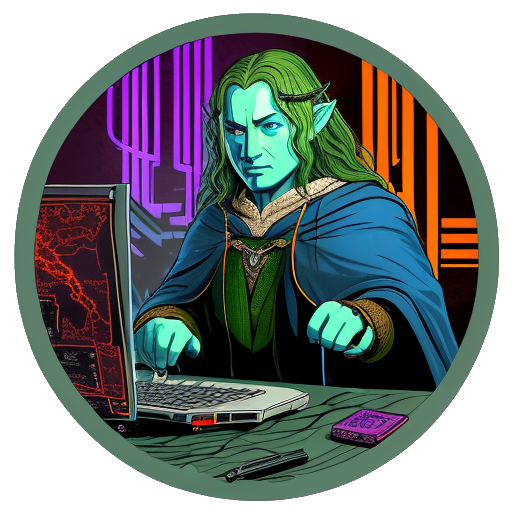

# Lollms for VS Code

  

Lollms (Lord of Large Language Models) is a powerful library that provides a Flask backend to interact with LLMS (Large Language Models). Lollms for VS Code is an extension built on top of Lollms, designed to facilitate automatic code synthesis by leveraging LLMS capabilities. With Lollms for VS Code, users can write comments or prompts, and the AI generates code snippets based on the provided input.

## Features

- Seamless integration with Visual Studio Code.
- Utilizes LLMS for automatic code generation from user comments or prompts.
- Supports both local LLMS instances for offline usage and ChatGPT for cloud-based text generation.
- Requires an OpenAI API key with a paid plan for ChatGPT functionality.

## Installation

To install Lollms for VS Code, follow these steps:

1. Make sure you have Visual Studio Code installed on your machine.
2. Launch Visual Studio Code.
3. Go to the Extensions view (Ctrl+Shift+X or Cmd+Shift+X on macOS).
4. Search for "Lollms" in the Extensions Marketplace.
5. Click on the "Install" button next to the Lollms extension.
6. Once installed, the extension will be ready to use.

## Usage

1. Open a project or create a new file in Visual Studio Code.
2. Write a comment or prompt describing the code you want to generate.
3. Use the Lollms extension to send the comment or prompt to the AI for code generation.
4. Wait for the AI to process the input and generate the code snippet.
5. The generated code will be displayed within Visual Studio Code, ready for you to use or modify.

## Configuration

Lollms for VS Code provides some configuration options to tailor the extension to your needs. To access the extension settings:

1. Open Visual Studio Code.
2. Go to the Settings view (File → Preferences → Settings or Ctrl+,).
3. Search for "Lollms" in the search bar.
4. Modify the desired settings as per your requirements.

Note: When using ChatGPT, you will need to provide your OpenAI API key in the extension settings to enable cloud-based code generation.

## Known Issues

- Offline code generation using local LLMS instances might experience slower response times compared to cloud-based ChatGPT.
- Some generated code snippets may require manual adjustments or additional refinement.

## Contributing

We welcome contributions from the community! If you would like to contribute to Lollms for VS Code, please follow the guidelines outlined in the CONTRIBUTING.md file.

## License

Lollms for VS Code is licensed under the Apache 2.0 License. For more information, see the [LICENSE](LICENSE) file.

## About the Author

Lollms for VS Code is developed and maintained by ParisNeo. ParisNeo is the main developer behind the Lollms project and is passionate about leveraging large language models for code generation.

## Contact

For any inquiries or feedback regarding Lollms for VS Code, please contact ParisNeo at [email protected]

---

*The slogan of Lollms is "One tool to rule them all," highlighting its versatility and power in code synthesis.*
